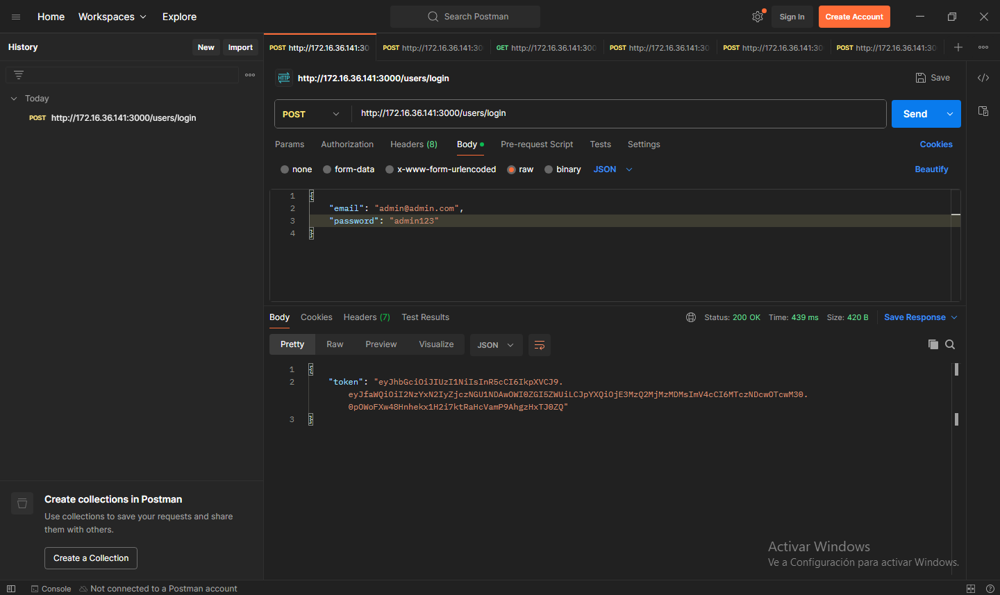
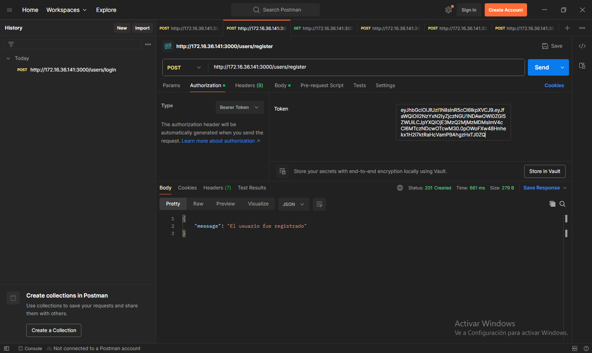
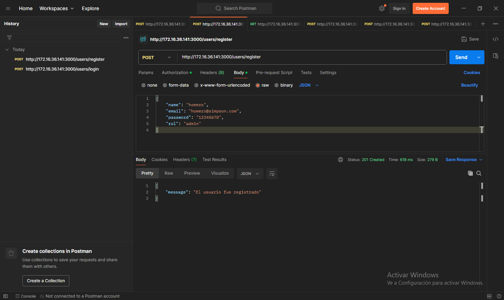
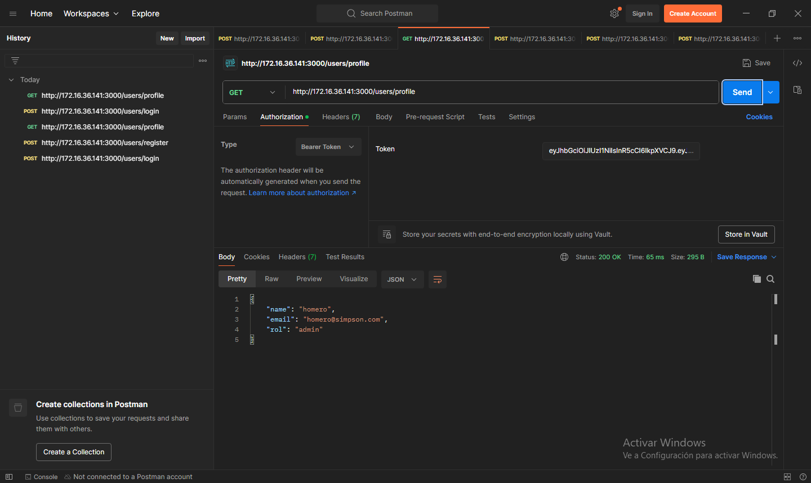
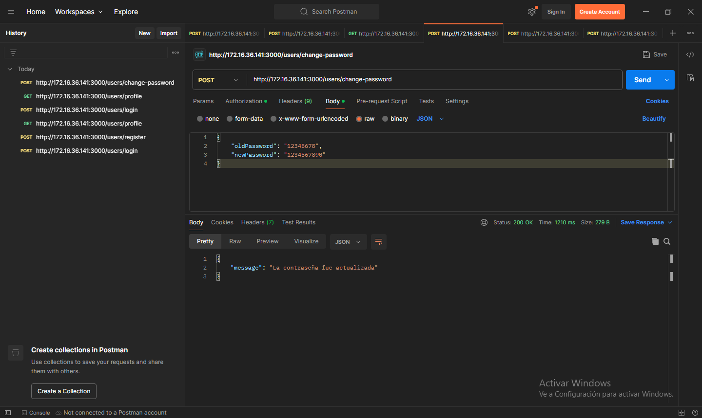
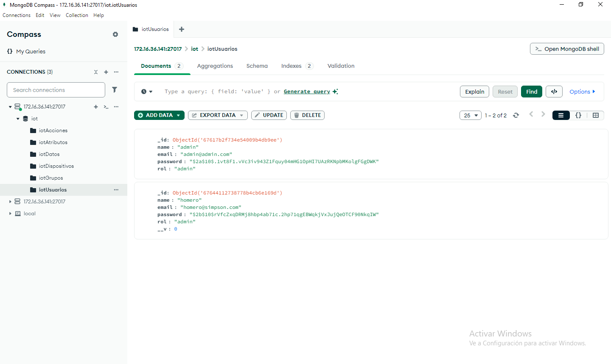
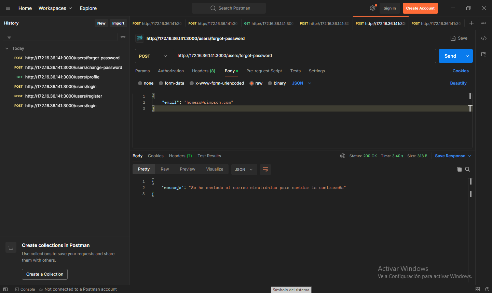
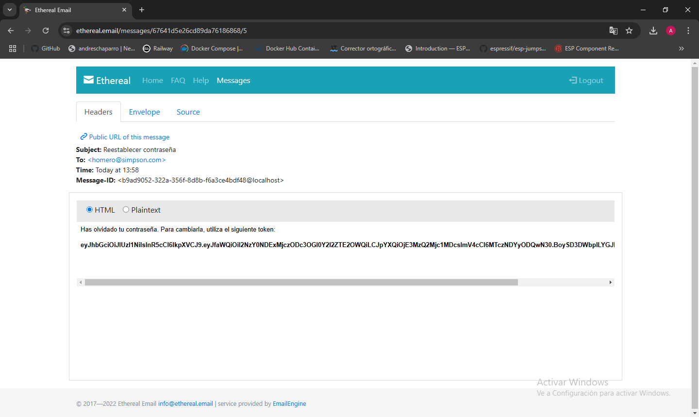
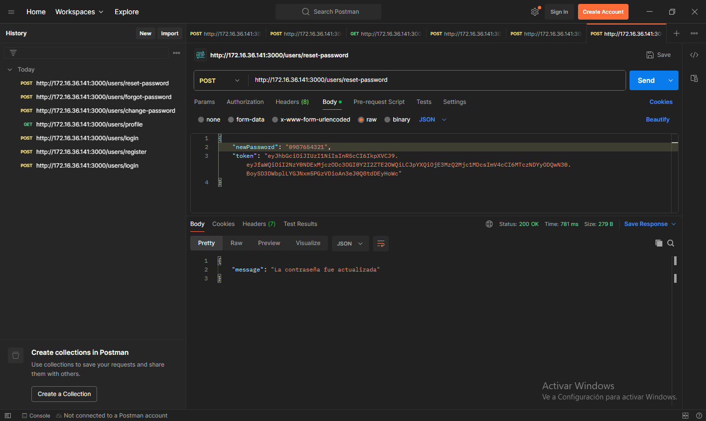

# Proyecto: Plataforma IoT para una Raspberry Pi 3 B+

## Etapa 1: Base de datos Mongo

Comandos útiles:

- `docker compose down`.
- `sudo rm -rf mongo/data`.
- `docker compose up --build -d`.

## Etapa 2: API para la base de datos

### Gestión de usuarios

Autor: Ing. Andres Chaparro
